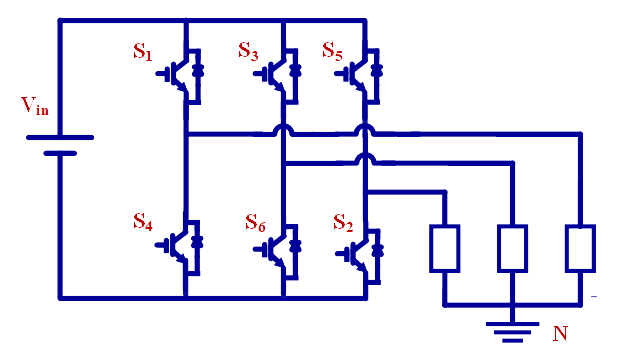
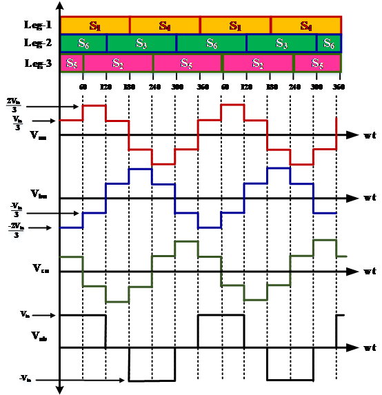

### Theory

- An inverter is a power electronic conversion circuit which converts DC supply into AC. Therefore, three-phase inverter converts DC into three-phase AC.
- Single-phase VSIs cover low-range power applications and three-phase VSIs cover the medium- to high-power applications.
- The main purpose of these topologies is to provide a three-phase voltage source, where the amplitude, phase, and frequency of the voltages should always be controllable.
- The standard three-phase VSI topology has eight valid switching states.

  
#### SIX-STEP VSI: 180&#176; CONDUCTION MODE 

  
  
Fig. 1.  180&#176; Mode of Conduction

 

- In the three-phase inverter, each switch conducts for 180o of a cycle. Switch pair in each arm, i.e. S1, S4; S3, S6 and S5, S4 are turned ON with a time interval of 180o
- It means that S1 conducts for 180o and S4 conducts for the next 180o of a cycle.
- Switches in the upper group, i.e. S1, S3, S5 conduct at an interval of 120o. It implies that if S1 is fired at wt=0o, then S3 must be fired at wt=120o and S5 at wt=240o. Same is true for lower group of switches.
- Each switch conducts for 180o in each cycle i.e. for half of cycle.
- Three switches conduct at the same time instant.
- It is shown in figure that in every step of 60o duration, only three switches are conducting, one from the upper group and two from the lower group or two from the upper group and one from the lower group.

#### 3-PHASE SINUSOIDAL PWM 

  
  
Fig. 2. 3-phase Sinusoidal PWM

 

- The objective in pulse-width-modulated three-phase inverters is to shape and control the three-phase output voltages in magnitude and frequency with an essentially constant input voltage Vin.
- In three-phase VSIs, the switches of any leg of the inverter (S1 and S4, S1 and S4, S1 and S4) cannot be switched ON simultaneously because this would result in short circuit across the DC supply.
- In order to generate a given voltage waveform, the inverter moves from one state to another. Thus the resulting ac output line voltages consist of discrete values of voltages that are Vin, 0 and –Vin.
- In Sine PWM, in order to produce 120o out-of-phase load voltages, three modulating signals that are 120o out of phase are used.
- In the three-phase inverters, only the harmonics in the line-to-line voltages are of concern. The harmonics in the output of any one of the legs, where only the odd harmonics exist as sidebands, centered around mf  and its multiples, provided mf is odd.
- For low values of mf, to eliminate the even harmonics, a synchronized PWM should be used and mf should be an odd integer. Moreover, mf should be a multiple of 3 to cancel out the most dominant harmonics in the line-to-line voltage.
- In the linear region, the fundamental-frequency component in the output voltage varies linearly with the amplitude modulation ratio ma
- the peak value of the fundamental-frequency component in one of the inverter legs is

 

  

    ..(1)

 

- Therefore, the line-to-line rms voltage at the fundamental frequency, due to 120" phase displacement between phase voltages, can be written as

 

  
      

    ..(2)

&nbsp;

  
      

    ..(3)

1
